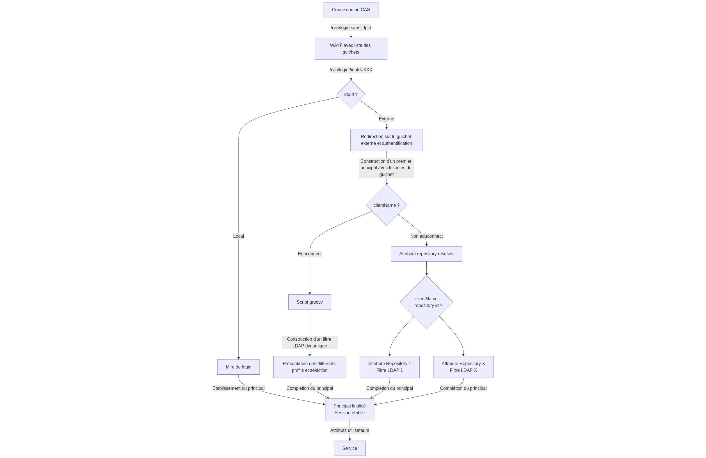

# Délégation d'authentification
 
Le schéma ci-dessous résume le flot de la délégation d'authentification :


 
## Principe

### WAYF

La page de login du CAS (`casLoginView.html`) a été modifiée pour acceuillir un WAYF : sans modification, on a le choix entre login/password et les différents IDP externes. Or, dans notre cas, on a d'abord une page avec tous les IDP (le login/password étant remplacé par un IDP, un peu comme si on se déléguait l'authentification à soi-même). Si on clique sur l'authentification locale, on est redirigé sur la page de login/password (sans aucun IDP affiché). L'astuce pour avoir ce comportement est la suivante :

Premièrement, on rajoute une condition sur l'apparition de la mire login/password, de sorte à ce que la mire ne s'affiche que quand il n'y a aucun IDP externe fourni au template :
```
${#bools.isFalse(delegatedAuthenticationProviderConfigurations)}
```

Ensuite, on rajoute en plus des IDP un autre lien un idpId unique qui correspond à l'authentification locale (par exemple `autre-publics`) : 
```html
<a th:href="${cas_base_url}?idpId=autres-publics">Authentification locale</a>
```

Au niveau du webflow, il faut faire en sorte de ne fournir aucun IDP dans le cas où on arrive l'idpId qui correspond à l'authentification locale. Il faut aussi renvoyer l'url de redirection demandée par le composant web qui affiche le WAYF, car le composant va uniquement compléter avec l'idpId, il faut donc lui envoyer le reste de l'url. Cela se fait dans le `DefaultDelegatedClientIdentityProviderConfigurationProducer` :
```java
if(request.getParameterMap().containsKey(delegationIdpIdParameter)){
	if(request.getParameterMap().get(delegationIdpIdParameter)[0].equals(delegationIdpIdLocalAuth)){
		DelegationWebflowUtils.putDelegatedAuthenticationProviderConfigurations(context, null);
	} else {
		DelegationWebflowUtils.putDelegatedAuthenticationProviderConfigurations(context, providers);
		DelegationWebflowUtils.putDelegatedAuthenticationDynamicProviderSelection(context, Boolean.FALSE);
	}
} else {
	if(webContext.getFullRequestURL().contains("?")){
		context.getRequestScope().put(providerSelectionWebflowUrlParameter, webContext.getFullRequestURL());
	} else {
		context.getRequestScope().put(providerSelectionWebflowUrlParameter, webContext.getFullRequestURL()+"?");
	}
	DelegationWebflowUtils.putDelegatedAuthenticationProviderConfigurations(context, providers);
	DelegationWebflowUtils.putDelegatedAuthenticationDynamicProviderSelection(context, Boolean.FALSE);
}
```

Enfin, pour rediriger sur les autres IDP quand on clique sur les boutons (où quand on arrive avec une URL en direct avec un idpId prédéfini), on utilise un script groovy. Le principe est de faire une présélection des IDP autorisés et de ne choisir que l'IDP correspondant à l'idpId tout en le passant en mode redirection automatique, ce qui aura pour conséquence de forcer CAS à choisir automatiquement cet IDP :

```groovy
def run(Object[] args) {
	def (requestContext,service,registeredService,providers,applicationContext,logger) = args
	providers.forEach(provider -> {
		logger.info("Checking ${provider.name}...")
		if (provider.name.equals(requestContext.getRequestParameters().get("idpId"))) {
			provider.autoRedirectType =  DelegationAutoRedirectTypes.SERVER
			return provider
		}
	})
	return null
}
```

### Authentification sur les IDP externes et mapping LDAP

Une fois l'utilisateur authentifié sur l'IDP externe, un principal est créé à partir des attributs renvoyés. L'étape suivante est de pouvoir associer un compte dans le LDAP à ce principal afin de compléter la liste de ces attributs pour que les services connectés au CAS puissent disposer de ces attributs (indépendamment de quel IDP on a utilisé). 

On récupère ces attributs à l'aide du système d'attribute repository en définissant un attribute repository par IDP externe, car même si on récupère les mêmes attributs, ce ne sera pas forcément le même filtre LDAP qui sera utilisé pour récupérer l'utilisateur (et un attribute repository ne dispose que d'un seul filtre LDAP). Ces attributes repository seront donc activés conditionnellement en fonction de l'IDP qui a été utilisé pour authentifier le principal.

La seule modification à faire est dans le `DefaultAttributeRepositoryResolver` pour faire en sorte de choisir l'attribute repository associé au nom unique de l'IDP (sauf dans le cas ou on passe par la profile selection, car les attributs sont récupérés d'une autre manière) :

```java
if(query.getAuthenticationHandler().getName().equals("DelegatedClientAuthenticationHandler")){
	if(!query.getPrincipal().getAttributes().get("clientName").getFirst().toString().equals("NOMUNIQUE")){
		repositoryIds.add(query.getPrincipal().getAttributes().get("clientName").getFirst().toString());
		return repositoryIds;
	} else {
		return repositoryIds;
	}
}
```

### Profile selection

**Activation**

Le flot de profile selection ne s'active que lorsqu'on s'authentifie via un IDP externe spécifique. Pour obtenir ce comportement, il faut faire une modification dans le `BaseDelegatedClientAuthenticationCredentialResolver`  :
```java
@Override
public boolean supports(final ClientCredential credentials) {
	if(credentials.getClientName().equals("NOMUNIQUE")){
		return  credentials  !=  null;
	} else {
		return false;
	}
}
```


**Filtre LDAP**

Ici, on n'a pas de notion d'attribute repository car les attributs sont récupérés au moment où on fait la requête LDAP pour trouver les profils. Le filtre LDAP pour trouver le/les profils correspondants et retourner les attributs est généré dynamiquement par un script groovy.

Une modification en deux étapes a été faite pour fournir au script groovy tous les attributs du principal (et pas seulement le principal id). La modification se fait d'abord dans `LdapDelegatedClientAuthenticationCredentialResolver` pour passer les paramètres au constructeur de filtre LDAP : 

```java
List<String> paramNames = new ArrayList<>();
List<String> values = new ArrayList<>();
for(String key : profile.getAttributes().keySet()){
	if(profile.getAttributes().get(key) instanceof List){
		List<Object> key_values = (List<Object>) profile.getAttributes().get(key);
		for(int  i=0; i<key_values.size(); i++){
			paramNames.add(key);
			values.add(key_values.get(i).toString());
		}
	} else {
		paramNames.add(key);
		values.add(profile.getAttributes().get(key).toString());
	}
}
val filter = LdapUtils.newLdaptiveSearchFilter(ldap.getSearchFilter(), paramNames, values);
```


Puis aussi dans `LdapUtils` pour passer les paramètres au script groovy :
```java
val parameters = IntStream.range(0, values.size())
	.boxed()
	.collect(Collectors.toMap(
		paramName::get,
		i -> new ArrayList<>(List.of(values.get(i))),
		(list1, list2) -> {
			list1.addAll(list2);
			return list1;
		},
		LinkedHashMap::new
	));
val args = CollectionUtils.<String, Object>wrap("filter", filter,
	"parameters", parameters,
	"applicationContext", ApplicationContextProvider.getApplicationContext(),
	"logger", LOGGER);
script.setBinding(args);
script.execute(args.values().toArray(), FilterTemplate.class);
```

**UI de choix du profil**

On veut pouvoir présenter les noms des établissements dans l'UI de la séléction de profil, malgré que ce ne soit pas un attribut utilisateur. Pour pouvoir l'ajouter au *candidate profile* (et donc l'afficher), il faut faire appel à une API externe en fonction du SIRENCourant actuel.Cet appel est réalisé dans le `DelegatedClientAuthenticationCredentialSelectionAction`, qui est l'action qui pousse les différents profils dans le webflow avant d'afficher la vue de séléction des profils.

L'UI (`casDelegatedAuthnSelectionView.html`) a également été modifiée en conséquence pour afficher ce nouvel attribut. La logique qui a été mise en place afin de ne pas faire d'appel à l'API quand cela n'est pas nécéssaire est la suivante (le système est très similaire à celui de la redirection multidomaine avec son cache):

```java
if (profiles.size() == 1) {
	val profile = profiles.getFirst();
	DelegationWebflowUtils.putDelegatedClientAuthenticationCandidateProfile(requestContext, profile);
	return new Event(this, CasWebflowConstants.TRANSITION_ID_FINALIZE,
	new LocalAttributeMap<>("profile", profile));
}

for(DelegatedAuthenticationCandidateProfile delegatedAuthenticationCandidateProfile: profiles){
	// Get siren from candidate profile
	final String siren = ...
	// Check if name is in cache
	if(this.nameBySirenCache.containsKey(siren)){
		final String displayName = this.nameBySirenCache.get(siren);
		delegatedAuthenticationCandidateProfile.getAttributes().put(structInfoWebflowAttributeName, displayName);
	}
	else {
		// Otherwise call API and extract from displayName from response
		String displayName = ...
		// Prepare to put result in webflow for profile selection view
		delegatedAuthenticationCandidateProfile.getAttributes().put(structInfoWebflowAttributeName, displayName);
		this.nameBySirenCache.put(siren, displayName);
	}
}

DelegationWebflowUtils.putDelegatedClientAuthenticationResolvedCredentials(requestContext, profiles);
return new Event(this, CasWebflowConstants.TRANSITION_ID_SELECT);
```

### Remontée des erreurs de délégation

**En mode auth déléguée**

Il faut pouvoir afficher un message d'erreur lorsqu'il y a une erreur dans le flot d'authentification déléguée (pas de compte correspondant dans le LDAP par exemple).

Pour cela, deux modifications ont été réalisées afin de lever une exception si aucun compte n'est trouvé (`result.getEntries().size() < 1`) : 
- Dans `LdaptivePersonAttributeDao` pour les attributes repositories classique ;
- Dans `LdapDelegatedClientAuthenticationCredentialResolver` pour la partie profile selection.

Il faut ensuite paramétrer correctement le CAS pour qu'il termine en erreur l'authentification si une partie de la chaîne est en erreur (sinon il peut continuer avec une erreur partielle) :

```
cas.person-directory.principal-resolution-failure-fatal: true
cas.authn.attribute-repository.core.recover-exceptions: false
cas.authn.attribute-repository.core.require-all-repository-sources: true
```

Il est aussi important de désaciver tous les attribute repositories par défaut, car sinon il retournera une erreur pour l'authentification locale pour lequel il ne trouvera aucun compte :

```
cas.person-directory.active-attribute-repository-ids: none
```

**En mode auth locale**

Dans le cas d'une authentification locale, il suffit de faire attention à ce que le formulaire de login effectue un POST sur l'url courante complète (et non juste sur `/cas/login`) afin de revenir sur le formulaire de login (sinon on revient sur le WAYF).

L'erreur est affichée dans le template `casLoginView.html` (et pas le fragment du `loginform.html` car elle ne remonte pas jusque là) :

```html
<form method="post" id="fm1-b" th:object="${credential}">
	<div id="login-form-controls">
		<div id="loginErrorsPanel" class="alert alert-danger banner banner-danger banner-dismissible" th:if="${#fields.hasErrors('*')}">
			<p th:each="err : ${#fields.errors('*')}" th:utext="${err + ' '}">Example error</p>
		</div>
	</div>
</form>
```

Ici on réutilise ce qui était prévu de base par CAS.

## Configuration 

### WAYF

Paramètre d'url utilisé pour identifier l'IDP vers lequel on doit rediriger :
```
cas.custom.properties.delegation.idp-id.parameter: idpId
```

Identifiant unique de l'IDP qui redirige vers l'authentification locale :
```
cas.custom.properties.delegation.idp-id.local-auth: autres-publics
```

Nom du paramètre du webflow utilisé pour passer l'url de redirection au template :
```
cas.custom.properties.delegation.provider-selection.webflow-url.parameter: cas_base_url
```

### Déclaration des IDP externes

La déclaration des IDP se fait via configuration. Pour chaque IDP il faut incrémenter l'index tout en mettant les bonnes valeurs dans les champs correspondants.

Conf SP (le serveur CAS agit comme SP auprès des IDP externes) :
```
cas.authn.pac4j.saml[X].service-provider-entity-id: https://localhost:8443/cas/azertyuiop
cas.authn.pac4j.saml[X].keystore-password: pac4j-demo-passwd
cas.authn.pac4j.saml[X].keystore-path: /etc/cas/AZERTYUIOP-keystore.jks
cas.authn.pac4j.saml[X].private-key-password: pac4j-demo-passwd
cas.authn.pac4j.saml[X].metadata.service-provider.file-system.location: /etc/cas/AZERTYUIOP-metadata.xml
```

L'URL des métadonnées de l'IDP (ou le chemin si local):
```
cas.authn.pac4j.saml[X].metadata.identity-provider-metadata-path: URL_METADATA
```

Il est important de donner un nom unique à l'IDP (il sera réutilisé ailleurs dans la configuration) :
```
cas.authn.pac4j.saml[X].client-name: NOMUNIQUE
```

Principal ID avant d'arriver dans les attributes repositories (utile car le filtre plus tard ne se base que sur le principal id) :
```
cas.authn.pac4j.saml[X].principal-id-attribute: xxx
```

Pour la profile selection c'est le même principe sauf qu'il n'y a pas besoin de déclarer de `principal-id-attribute` car le filtre LDAP se base sur tous les attributs du principal.  Il faut juste déclarer ce paramètre supplémentaire pour activer la profile selection quand on utilise cet IDP spéficiquementIl faut juste déclarer ce paramètre supplémentaire pour activer la profile selection quand on utilise cet IDP : :
```
cas.custom.properties.profile-selection.client-name: NOMUNIQUE
```

### Attribute repositories

**Paramètres communs aux attributes repositories**

Attribut principal en sortie des attributes repositories (le principal id en sortie de la chaîne) :
```
cas.person-directory.principal-attribute: uid
cas.person-directory.principal-resolution-conflict-strategy: first
```

Il y a un paramétrage similaire dans le cas de l'authentification locale :
```
cas.person-directory.use-existing-principal-id: true
```

**Conf repository par repository**

Au niveau des attributs repositories c'est le même principe, il faut incrémenter l'index pour chaque IDP. La seule valeur autre à changer devrait être le filtre de recherche. Par défaut les attribute repositories sont désactivés en ne sont activés qui conditionnellement. A noter qu'un attribute repository correspond à un IDP et qu'il doit avoir le **même** nom que l'IDP.
```
cas.authn.attribute-repository.ldap[X].id: NOMUNIQUE
cas.authn.attribute-repository.ldap[X].state: STANDBY
cas.authn.attribute-repository.ldap[X].search-filter: ATTRIBUT_LDAP={0}
cas.authn.attribute-repository.ldap[X].attribute.xxx : xxx
cas.authn.attribute-repository.ldap[X].attribute.yyy : yyy
...
```

**Cas spécial pour la profile selection**

La récupération des attributs se fait directement dans la phase de profile selection (il n'y a pas d'appel aux repositories après)  :
```
cas.authn.pac4j.profile-selection.ldap[X].search-filter: classpath:/groovy-test/multi-profile-filter.groovy
cas.authn.pac4j.profile-selection.ldap[X].attributes: xxx, yyy
```

Principal id en sortie de la profile selection :
```
cas.authn.pac4j.profile-selection.ldap[X].profile-id-attribute: uid
```

Le filtre LDAP est un chemin vers un script groovy de ce genre :
```gradle
def run(Object[] args) {
	def (filter,parameters,applicationContext,logger) = args
	// Parameters est une map contenant les attributs du principal {attr1 : [value1], ...}

	// Construire le filtre en fonction des paramètres d'éntrée
	String finalFilter = ""

	// Définir le filtre final utilisé pour la recherche
	filter.setFilter(finalFilter)
}
```

### Authentification locale

L'authentification locale se fait via LDAP, la configuration est très ressemblante à celle des attribute repositories :
```
cas.authn.ldap[0].search-filter: ATTRIBUT_LDAP={0}
cas.authn.ldap[0].type: AUTHENTICATED
cas.authn.ldap[0].principal-attribute-id: zzz
cas.authn.ldap[0].principal-attribute-list: xxx, yyy
```

Dans ce cas il n'y a pas non plus de passage par les attribute repositories.


### Profile selection

Infos par rapport à l'appel API (entrée, url, sortie):
```
cas.custom.properties.profile-selection.structinfo-attribute-identifier-name: ESCOSIRENCourant
cas.custom.properties.profile-selection.structinfo-url: http://localhost:7001/structsinfo
cas.custom.properties.profile-selection.structinfo-attribute-to-display: displayName
```

Nom de l'attribut mis dans le webflow :
```
cas.custom.properties.profile-selection.structinfo-webflow-attribute-name: ETAB_NAME
```

Durée du cache :
```
cas.custom.properties.profile-selection.structinfo.refresh-cache-interval: PT24H
```